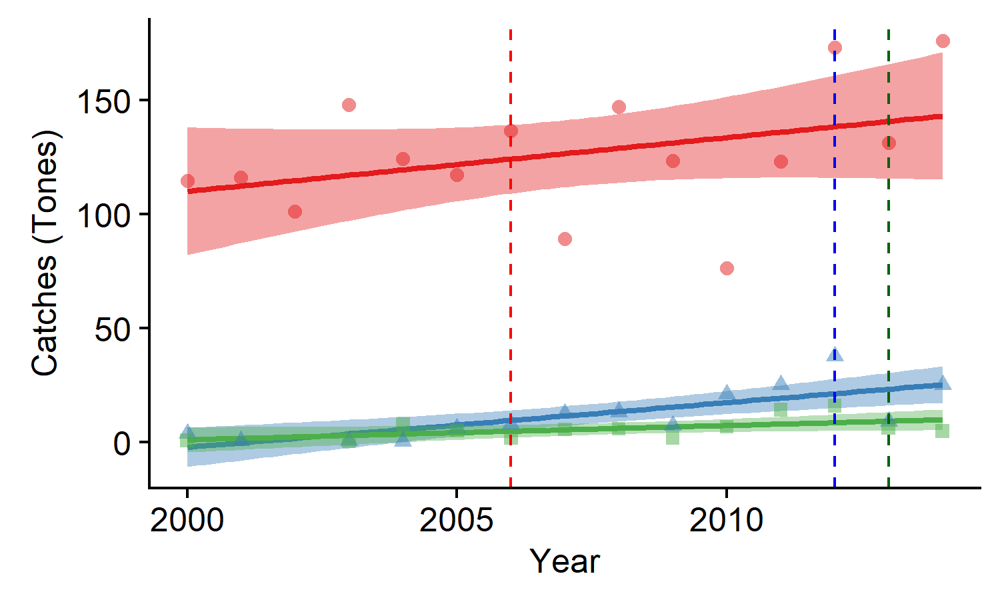
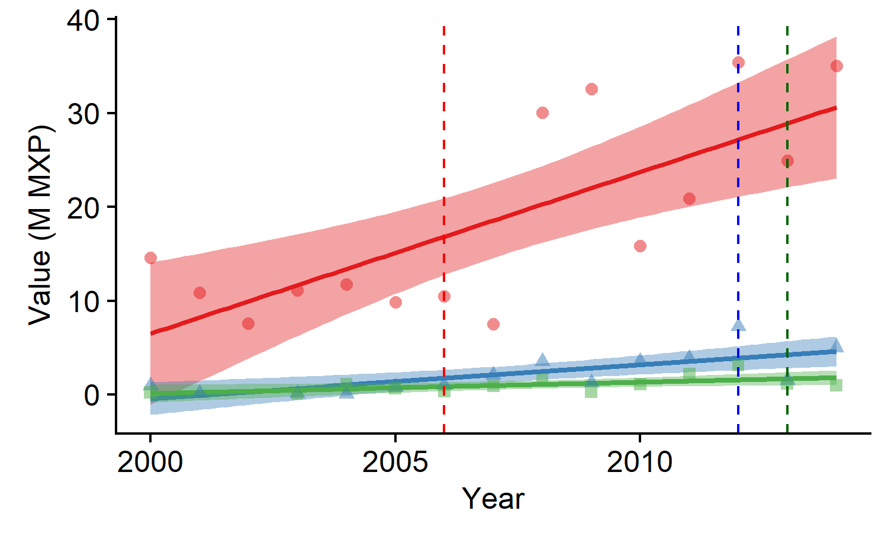

```{r setup, include = FALSE}
knitr::opts_chunk$set(echo = FALSE)
```

# Background

In Mexico:

- Increased advocacy for marine reserves

--

- These are implemented as:

--

  - No-take zone within MPA (bottom-up)
  
--

  - Community-based (usually within a TURF)
  
--

  - Fishing refugia (a community-based, with legal recognition)
  
---

# Background

In Mexico:

- Increased advocacy for marine reserves

- These are implemented as:

    - No-take zone within MPA (bottom-up)
    
    - **Community-based (usually within a TURF)**
    
    - **Fishing refugia (a community-based, with legal recognition)**

---

```{r}
suppressPackageStartupMessages({
  library(sp)
  library(sf)
  library(ggsn)
  library(tmap)
  library(magrittr)
  library(kableExtra)
  library(broom)
  library(tidyverse)
})
```

# Where

```{r load_spatial}
# Determine a projection for the maps
proj <- CRS("+proj=longlat +datum=NAD27")

# Load coastline for Mexico and World
data(World)
W <- spTransform(World, proj) %>% 
  st_as_sf()

# Load high-res mexican coastline
coastline_mx <- readRDS("./Data/Spatial/coastline_mx.rds")

# Declare points for reference map
location_labels <- data.frame(X = c(-115.24, -87.4611756),
                              Y = c(27.85, 19.3183386),
                              Location = c("Isla Natividad", "Punta Herrero"),
                              Region = c("Pacific", "Caribbean"),
                              N = c("N = 1", "N = 3"),
                              stringsAsFactors = F)

zrp <- st_read(dsn = "./Data/Spatial", layer = "ZRP", quiet = T) %>% 
  sf::st_centroid() %>% 
  select(Name, geometry) %>% 
  mutate(Type = "FR")

rescom <- st_read(dsn = "./Data/Spatial", layer = "Res_Com", quiet = T) %>% 
  sf::st_centroid() %>% 
  select(Name = Nombre, geometry) %>% 
  mutate(Type = "CB")

reserves <- rbind(zrp, rescom)

ggplot() +
  geom_sf(data = W) +
  geom_sf(data = reserves, aes(fill = Type), shape = 21) +
  theme_classic() +
  scale_color_brewer(palette = "Set1") +
  scale_fill_brewer(palette = "Set1") +
  theme(legend.position = c(0.9, 0.5)) +
  lims(x = c(-118.36648, -86.71074), y = c(14.53507, 32.71863))
```

---

# Where

```{r}
ggplot() +
  geom_sf(data = W) +
  theme_classic() +
  geom_point(data = location_labels, aes(x = X, y = Y), fill = "red", size = 3, shape = 21) +
  geom_text(data = location_labels, aes(x = X, y = Y, label = N), nudge_x = -1.5) +
  lims(x = c(-118.36648, -86.71074), y = c(14.53507, 32.71863))
```


---

# Brief context

```{r}
data.frame(Community = c("Isla Natividad", "Maria Elena", "Punta Herrero"),
           N_reserves = c(2, 3, 3),
           N_reserves2 = c("1", "1", "2*"),
           Size = c(10.58, 483.98, 153.13),
           Implemented = c(2006, 2012, 2013)) %>% 
  knitr::kable(format = "html", col.names = c("Community", "Reserves", "Evaluated", "Size (ha)", "Implemented"))
```

--

- All have cooperatives and TURF's

--

- The objectives are *"mixed"* on paper (consrvation + fisheries)
- Ask a fisher, they'll say:

> "We want to increase lobsters populations and catches"

---


Lobster is their most important resource

- (*Panulirus interruptus* and *P. argus*)

---
class: inverse

# Questions

--

## Are these community-based marine reserves effective?

--

## Are they effective for lobster?

--

## What are the enabling conditions?

---

# Methods

Data:

--

- Fish and invert surveys BACI

--

- Timeseries of landings and income BA

--

- Data on how the communities operate

---

# Methods

## Biological

- Biomass

- Abundances

  - Lobster abundances

- Richness

$$I_{i,t,s} = \alpha_{i} + \sum_{t = 1}^T\gamma_{t} Y_t + \beta Z_i +  \sum_{t = 1}^T\lambda_{t} Y_t\times Z_i + \sum_{s = 1}^S\sigma_s S_s + \epsilon$$

- I care about $\lambda_{t}$

---

## Fisheries side

- Change in lobster income and landings

## Social / governance data

- Thanks Ere!

  - Rules and structures under which decisions are made
  
  - Use this to help identify "enabling conditions"

---

# Results

Are these community-based marine reserves effective?


---

# Results

Are these community-based marine reserves effective?


---

## Are they effective for lobster?

Lobster abundances


---

## Are they effective for lobster?

<table style="text-align:center">
<tr><td colspan="7" style="border-bottom: 1px solid black"></td></tr><tr><td style="text-align:left"></td><td colspan="6"><em>Dependent variable:</em></td></tr>
<tr><td></td><td colspan="6" style="border-bottom: 1px solid black"></td></tr>
<tr><td style="text-align:left"></td><td colspan="3">Catches (tones)</td><td colspan="3">Revenue(M MXP)</td></tr>
<tr><td style="text-align:left"></td><td>(IN)</td><td>(ME)</td><td>(PH)</td><td>(IN)</td><td>(ME)</td><td>(PH)</td></tr>
<tr><td colspan="7" style="border-bottom: 1px solid black"></td></tr><tr><td style="text-align:left">PostbPost</td><td>7.37</td><td>5.83</td><td>-1.26</td><td><strong>14.37<sup>***</sup></strong></td><td>1.24</td><td>-0.06</td></tr>
<tr><td style="text-align:left">Constant</td><td>122.68<sup>***</sup></td><td>11.41<sup>***</sup></td><td>6.06<sup>***</sup></td><td>10.89<sup>***</sup></td><td>2.04<sup>***</sup></td><td>1.06<sup>***</sup></td></tr>
<tr><td colspan="7" style="border-bottom: 1px solid black"></td></tr><tr><td style="text-align:left">Observations</td><td>15</td><td>14</td><td>13</td><td>15</td><td>14</td><td>13</td></tr>
<tr><td style="text-align:left">R<sup>2</sup></td><td>0.02</td><td>0.04</td><td>0.01</td><td>0.52</td><td>0.04</td><td>0.0004</td></tr>
<tr><td colspan="7" style="border-bottom: 1px solid black"></td></tr><tr><td style="text-align:left"><em>Note:</em></td><td colspan="6" style="text-align:right"><sup>*</sup>p<0.1; <sup>**</sup>p<0.05; <sup>***</sup>p<0.01</td></tr>
</table>

---

## Are they effective for lobster?



---

## Are they effective for lobster?



---

# Results

Enabling conditions

```{r}
data.frame(Feature = c("No-take", "Well-enforced", "Old (> 10yrs)", "Large", "Isolated", "Presence of mgmt plan", "Fisher engange in mgmt", "Fishers make decisions"),
           IN = c(1, 1, 1, 0, 1, 0.5, 1, 1), 
           ME = c(1, 1, 0, 0, 0.5, 0.5, 1, 1),
           PH = c(1, 0.5, 0, 0, 0.5, 0, 1, 1)) %>% 
  knitr::kable(format = "html")
```

From: Edgar *et al.*, (2014); Di Franco *et al.* (2016)

---

# 


