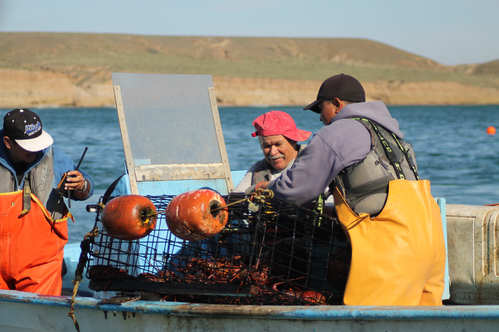
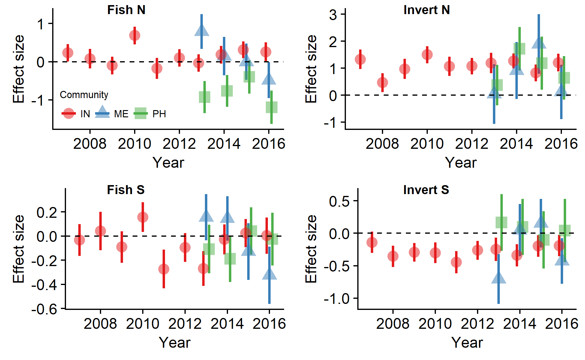
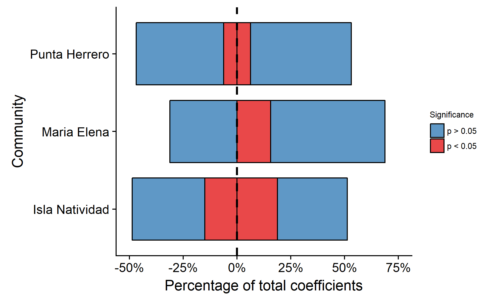
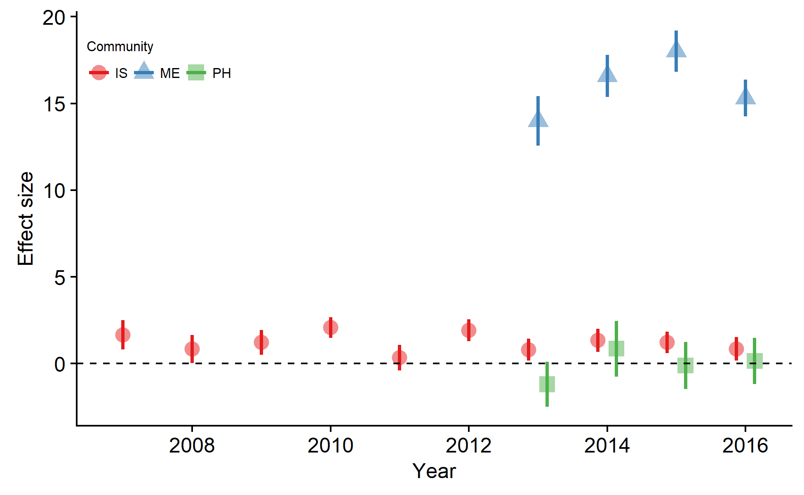

```{r setup, include = FALSE}
knitr::opts_chunk$set(echo = FALSE)
```

# Before we start

- This is onging work

- Other collaborators

- Help me better tell the story (if there is one)


> Even when a community is very well organized, environmental variation can hinder reserve effectiveness

> Even if environment is stable, lack of community organization can hinder reserve effectiveness

---

# Background

In Mexico:

- Increased advocacy for marine reserves

--

- These are implemented as:

--

  - No-take zone within MPA (bottom-up)
  
--

  - Community-based (usually within a TURF)
  
--

  - Fishing refugia (a community-based, with legal recognition)
  
---

# Background

In Mexico:

- Increased advocacy for marine reserves

- These are implemented as:

    - No-take zone within MPA (bottom-up)
    
    - **Community-based (usually within a TURF)**
    
    - **Fishing refugia (a community-based, with legal recognition)**

---

```{r}
suppressPackageStartupMessages({
  library(sp)
  library(sf)
  library(ggsn)
  library(tmap)
  library(magrittr)
  library(kableExtra)
  library(broom)
  library(tidyverse)
})
```

# Where

```{r load_spatial}
# Determine a projection for the maps
proj <- CRS("+proj=longlat +datum=NAD27")

# Load coastline for Mexico and World
data(World)
W <- spTransform(World, proj) %>% 
  st_as_sf()

# Load high-res mexican coastline
coastline_mx <- readRDS("./Data/Spatial/coastline_mx.rds")

# Declare points for reference map
location_labels <- data.frame(X = c(-115.24, -87.4611756),
                              Y = c(27.85, 19.3183386),
                              Location = c("Isla Natividad", "Punta Herrero"),
                              Region = c("Pacific", "Caribbean"),
                              N = c("N = 1", "N = 3"),
                              stringsAsFactors = F)

zrp <- st_read(dsn = "./Data/Spatial", layer = "ZRP", quiet = T) %>% 
  sf::st_centroid() %>% 
  select(Name, geometry) %>% 
  mutate(Type = "FR")

rescom <- st_read(dsn = "./Data/Spatial", layer = "Res_Com", quiet = T) %>% 
  sf::st_centroid() %>% 
  select(Name = Nombre, geometry) %>% 
  mutate(Type = "CB")

reserves <- rbind(zrp, rescom)

ggplot() +
  geom_sf(data = W) +
  geom_sf(data = reserves, aes(fill = Type), shape = 21) +
  theme_classic() +
  scale_color_brewer(palette = "Set1") +
  scale_fill_brewer(palette = "Set1") +
  theme(legend.position = c(0.9, 0.5)) +
  lims(x = c(-118.36648, -86.71074), y = c(14.53507, 32.71863))
```

---

# Where

```{r}
ggplot() +
  geom_sf(data = W) +
  theme_classic() +
  geom_point(data = location_labels, aes(x = X, y = Y), fill = "red", size = 3, shape = 21) +
  geom_text(data = location_labels, aes(x = X, y = Y, label = N), nudge_x = -1.5) +
  lims(x = c(-118.36648, -86.71074), y = c(14.53507, 32.71863))
```


---

# Brief context

```{r}
data.frame(Community = c("Isla Natividad", "Maria Elena", "Punta Herrero"),
           N_reserves = c(2, 3, 3),
           N_reserves2 = c("1", "1", "2*"),
           Size = c(10.58, 9.73, 527.79),
           Implemented = c(2006, 2012, 2013)) %>% 
  knitr::kable(format = "html", col.names = c("Community", "Reserves", "Evaluated", "Size (ha)", "Implemented"))
```

--

- All have cooperatives and TURF's

--

- The objectives are *"mixed"* on paper (conservation + fisheries)

---

- Ask a fisher, they'll say:

> "We want to increase lobster populations and catches"



---
class: inverse

# Questions

--

## Are these community-based marine reserves effective?

--

## Are they effective for lobster?

--

## How do environmental and social dynamics influence the outcomes of community-based marine reserves?

---

# Methods

Combine:

- Causal inference

- Operationalization of the social-ecological systems framework (Gracias Ere!)

--

Data:

- Fish and invert surveys BACI

--

- Timeseries of landings and income BA

--

- Data on how the communities operate

---

# Methods

## Biological

- Biomass

- Abundances

  - Lobster abundances

- Richness

$$I_{i,t,s} = \alpha_{i} + \sum_{t = 1}^T\gamma_{t} Y_t + \beta Z_i +  \sum_{t = 1}^T\lambda_{t} Y_t\times Z_i + \sum_{s = 1}^S\sigma_s S_s + \epsilon$$

- I care about $\lambda_{t}$

---

## Fisheries-side

- Change in lobster income and landings

## Social / governance data

- Rules and structures under which decisions are made
  
- Use this to help identify "enabling conditions"

---

# Results

Are these community-based marine reserves effective?



---

# Results

.pull-left[
Some general trends:
- Positive effects in invertebrate abundances
- Fish richness post 2010 takes a dive (IN)
- Negative effect in invertebrate richness (IN)
- Not much more...
]

.pull-right[

]

---


# Results

Are these community-based marine reserves effective?



---

# Results

Are they effective for lobster?

Lobster abundances



---

# Results

Are they effective for lobster?

- Landings and income

<table style="text-align:center">
<tr><td colspan="7" style="border-bottom: 1px solid black"></td></tr><tr><td style="text-align:left"></td><td colspan="6"><em>Dependent variable:</em></td></tr>
<tr><td></td><td colspan="6" style="border-bottom: 1px solid black"></td></tr>
<tr><td style="text-align:left"></td><td colspan="3">Landings (tones)</td><td colspan="3">Revenue(M MXP)</td></tr>
<tr><td style="text-align:left"></td><td>(IN)</td><td>(ME)</td><td>(PH)</td><td>(IN)</td><td>(ME)</td><td>(PH)</td></tr>
<tr><td colspan="7" style="border-bottom: 1px solid black"></td></tr><tr><td style="text-align:left">Post</td><td>7.37</td><td>5.83</td><td>-1.26</td><td><strong>14.37<sup>***</sup></strong></td><td>1.24</td><td>-0.06</td></tr>
<tr><td style="text-align:left">Constant</td><td>122.68<sup>***</sup></td><td>11.41<sup>***</sup></td><td>6.06<sup>***</sup></td><td>10.89<sup>***</sup></td><td>2.04<sup>***</sup></td><td>1.06<sup>***</sup></td></tr>
<tr><td colspan="7" style="border-bottom: 1px solid black"></td></tr><tr><td style="text-align:left">Observations</td><td>15</td><td>14</td><td>13</td><td>15</td><td>14</td><td>13</td></tr>
<tr><td style="text-align:left">R<sup>2</sup></td><td>0.02</td><td>0.04</td><td>0.01</td><td>0.52</td><td>0.04</td><td>0.0004</td></tr>
<tr><td colspan="7" style="border-bottom: 1px solid black"></td></tr><tr><td style="text-align:left"><em>Note:</em></td><td colspan="6" style="text-align:right"><sup>*</sup>p<0.1; <sup>**</sup>p<0.05; <sup>***</sup>p<0.01</td></tr>
</table>

---

## Are they effective for lobster?

Income

```{r, warning = F, message = F}

load("./Data/conapesca_2000-2015.RData")

cpi <- read.csv("./Data/CPI.csv", stringsAsFactors = F, strip.white = T)

cpi_2014 <- cpi$CPI[cpi$Ano == 2014]

conapesca %<>%
  filter(UnidadEconomica %in% c("Scpp cozumel scl",
                                "Scpp jose maria azcorra scl",
                                "Scpp buzos y pescadores de la baja california scl")) %>% 
  filter(NombreComun %in% c("Langosta roja ent. fca.", "Langosta ent. fca.")) %>%
  group_by(UnidadEconomica, Ano, NombreComun) %>%
  summarize(PesoDesembarcado = sum(PesoDesembarcado), 
            PesoVivo = sum(PesoVivo),
            Valor = sum(Valor)) %>%
  filter(!(UnidadEconomica == "Scpp buzos y pescadores de la baja california scl" & NombreComun == "Langosta ent. fca.")) %>% 
  left_join(cpi, by = "Ano") %>% 
  mutate(Valor = Valor * (CPI / cpi_2014))


L_conapesca <- tibble(UnidadEconomica = c("Scpp buzos y pescadores de la baja california scl",
                                          "Scpp cozumel scl",
                                          "Scpp jose maria azcorra scl"),
                      Comunidad = c("Isla Natividad",
                                    "Maria Elena",
                                    "Punta Herrero")) %>% 
  left_join(conapesca, ., by = "UnidadEconomica") %>% 
  mutate(Post = case_when(Comunidad == "Isla Natividad" && Ano <= 2006 ~ 0,
                          Comunidad == "Maria Elena" && Ano <= 2012 ~ 0,
                          Comunidad == "Punta Herrero" && Ano <= 2013 ~ 0,
                          TRUE ~ 1))

L_conapesca2 <- L_conapesca %>% 
  group_by(Comunidad, Post) %>% 
  summarize(meanC = mean(PesoVivo/1000),
            meanI = mean(Valor/1e6))

left_join(L_conapesca, L_conapesca2, by = c("Comunidad", "Post")) %>% 
  ggplot(aes(x = Ano, y = Valor/1e6, color = Comunidad, group = paste(Comunidad, Post), fill = Comunidad)) +
  geom_line(aes(y = meanI), size = 1) +
  geom_point(aes(shape = Comunidad), size = 2) +
  scale_color_brewer(palette = "Set1") +
  scale_fill_brewer(palette = "Set1") +
  geom_vline(xintercept = c(2006.5, 2012.5, 2013.5), color = c("red", "blue", "darkgreen"), linetype = "dashed", size = 0.5) +
  labs(x = "Year", y = "Income (M MXP)") +
  theme(legend.position = "none",
        text = element_text(size = 12)) +
  cowplot::theme_cowplot()
```

---

## Are they effective for lobster?

Landings

```{r}
left_join(L_conapesca, L_conapesca2, by = c("Comunidad", "Post")) %>% 
  ggplot(aes(x = Ano, y = PesoVivo/1e3, color = Comunidad, group = paste(Comunidad, Post), fill = Comunidad)) +
  geom_line(aes(y = meanC), size = 1) +
  geom_point(aes(shape = Comunidad), size = 2) +
  scale_color_brewer(palette = "Set1") +
  scale_fill_brewer(palette = "Set1") +
  geom_vline(xintercept = c(2006.5, 2012.5, 2013.5), color = c("red", "blue", "darkgreen"), linetype = "dashed", size = 0.5) +
  labs(x = "Year", y = "Landings (Tones)") +
  theme(legend.position = "none",
        text = element_text(size = 12)) +
  cowplot::theme_cowplot()
```

---

# Results

Isla Natividad

- Designed for invertebrates
  
--

- Very well organized community
  
--

- Relatively isolated, but still surrounded by "good fishers"

--

- Reserve is well enforced

--

- Reserve has been in place quite some time

--

- Should be the perfect example... but
  
--
  
- Has had mass mortality events due to hypoxia (2009, 2010) and warm water (~2015)
  

---

# Results

Maria Elena
  
- Also intended to protect grouper reproductive aggregations
  
--
  
- Well enforced
  
--
  
- Community is very well organized
  
--
  
- No hypoxia or other environmental disturbances
  
--
  
- Small (~ 10 ha)
  
--
  
- Fairly young (5 years of data)

---

# Results

Punta Herrero

--

- Also intended to protect grouper reproductive aggregations

--

- Good size (~ 500 ha)

--

- Low enforcement

--

- Community is not very well organized

--

- No hypoxia or other environmental disturbances

--

- Fairly young (4 years of data)

---

# Telling the story

> Even when a community is very well organized, environmental variation can hinder reserve effectiveness

> Even if environment is stable, lack of community organization can hinder reserve effectiveness

## Missing pieces

- Data on environmental disturbances (can get DO, S, T > 2009 for N)

---
background-image: url(https://raw.githubusercontent.com/jcvdav/ReserveEffect/master/Img/Imagen5.jpg)
class: inverse, center, middle
background-size: cover

# Thanks!

--

## Questions?

--

## Suggestions?

--

## Comments?

--

### Anyone??

--

# Help!

---

---

# Extras

Enabling conditions

```{r}
data.frame(Feature = c("No-take", "Well-enforced", "Old (> 10yrs)", "Large", "Isolated", "Presence of mgmt plan", "Fisher engange in mgmt", "Fishers make decisions"),
           IN = c(1, 1, 1, 0, 1, 0.5, 1, 1), 
           ME = c(1, 1, 0, 0, 0.5, 0.5, 1, 1),
           PH = c(1, 0.5, 0, 0, 0.5, 0, 1, 1)) %>% 
  knitr::kable(format = "html")
```

From: Edgar *et al.*, (2014); Di Franco *et al.* (2016)


